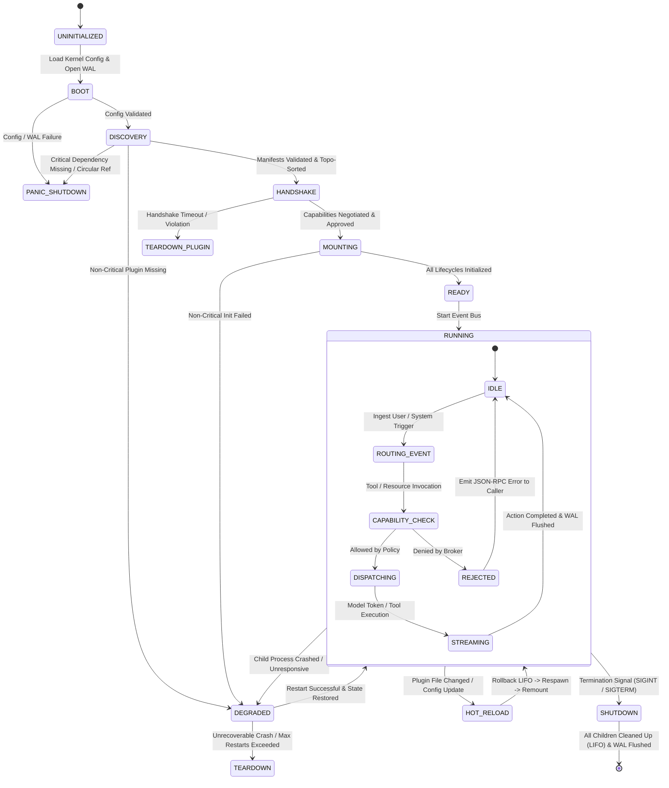

# System Design Log: Sovereign AI Microkernel

---

## 1. System Overview & Core Invariants

The Sovereign AI Microkernel is a minimalist host runtime written in Rust. It does not possess intrinsic knowledge of AI workflows, prompts, models, or UIs. Its primary function is to serve as an **isolated process supervisor, capability-policing broker, and append-only event router**.

### Architectural Invariants
1. **Isolated Execution**: Every plugin runs in its own operating system process with zero shared address space.
2. **Zero Ambient Authority**: A newly spawned plugin process possesses no privileges (no raw filesystem roots, no open network sockets, no environment secrets).
3. **Transparent Wire**: All inter-plugin and kernel-plugin traffic is strictly standard **JSON-RPC 2.0 over stdio** (`stdin`/`stdout`). Standard error (`stderr`) is captured by the kernel for diagnostic logging.
4. **Deterministic Unwinding (RAII)**: If a plugin crashes, stalls, or is unloaded, all registered event hooks, channels, and child handles are rolled back in strict LIFO order.
5. **Immutable Audit Trail**: Every JSON-RPC exchange is mirrored synchronously to an append-only Write-Ahead Log (WAL) before execution.

---

## 2. Microkernel State Machine

The microkernel progresses through a deterministic finite state machine (FSM).



---

## 3. Detailed State Definitions & Transitions

### State 0: `UNINITIALIZED`
* **Entry Condition**: Executable invoked.
* **Actions**:
  * Set up low-level OS signal handlers (`SIGINT`, `SIGTERM`, `SIGCHLD`).
  * Initialize the memory allocator and thread pool.
* **Transitions**:
  * $\rightarrow$ `BOOT` on process entry.

---

### State 1: `BOOT` (Kernel Startup)
* **Actions**:
  * Read and validate the host configuration file (`kernel.toml`).
  * Initialize the **Write-Ahead Log (WAL)** engine. Create or open the session journal file (`session.wal.jsonl`).
  * Read the **Security & Capability Policy Matrix** (defining permitted domains, allowed filesystem workspaces, forbidden syscalls).
* **Guarantees**: If the WAL cannot be safely opened or write permissions fail, the kernel aborts immediately.
* **Transitions**:
  * $\rightarrow$ `DISCOVERY` when config & WAL are locked and verified.
  * $\rightarrow$ `PANIC_SHUTDOWN` if config is corrupted or disk is read-only.

---

### State 2: `DISCOVERY` (Manifest Resolution & Dependency Graph)
* **Actions**:
  * Scan designated plugin locations (e.g., `./plugins/`, user config directories).
  * Read each plugin's manifest (`plugin.toml` or `plugin.json`).
  * Verify cryptographic hashes or local signatures (if configured).
  * Build the **Plugin Dependency Graph**:
    * Resolve required capabilities against offered capabilities.
    * Perform a topological sort to establish the deterministic initialization order.
    * Detect circular dependencies or missing required capabilities.
* **Transitions**:
  * $\rightarrow$ `HANDSHAKE` if the dependency graph is fully satisfied.
  * $\rightarrow$ `DEGRADED` if optional/non-critical plugins fail integrity checks.
  * $\rightarrow$ `PANIC_SHUTDOWN` if a core capability (e.g. no Model Provider available) cannot be resolved.

---

### State 3: `HANDSHAKE` (Supervision & Capability Negotiation)
* **Actions**:
  * For each plugin in topological order:
    1. Spawn the plugin as an isolated OS process (`stdin`, `stdout`, `stderr` redirected through OS pipes).
    2. Zero Ambient Authority: Strip environment variables; pass only explicit runtime configuration.
    3. Send the initialization request: `kernel/handshake`.
    4. Start a **Handshake Watchdog Timer** (e.g., default 3000ms).
  * Plugin responds with `plugin/announce`:
    * List of capabilities it exports (e.g., `model.generate`, `tools.file_read`).
    * List of capabilities it requests (e.g., `workspace.read`, `net.outbound`).
  * **The Capability Broker Interception**:
    * The broker evaluates the plugin's requested capabilities against the system security policy.
    * If accepted, the kernel returns `kernel/handshake_ack` containing a cryptographically random session lease token.
    * If rejected, the kernel returns an error and kills the child process.
* **Transitions**:
  * $\rightarrow$ `MOUNTING` upon successful acknowledgment of all required plugins.
  * $\rightarrow$ `DEGRADED` / `TEARDOWN_PLUGIN` if a non-critical plugin times out during handshake.

---

### State 4: `MOUNTING` (LIFO Registration)
* **Actions**:
  * The kernel constructs a dedicated **Plugin Fiber & Cleanup Stack** for each verified plugin.
  * Each export, subscription, and hook registered by the plugin pushes a **Revertible Disposal Guard** onto the plugin's LIFO stack.
  * Kernel calls `plugin/init` with the confirmed active environment and context.
* **Transitions**:
  * $\rightarrow$ `RUNNING (READY)` when all components acknowledge readiness.

---

### State 5: `RUNNING` (Active Event & Capability Loop)
The operational core of the runtime. It operates as a concurrent, event-driven dispatcher:

1. **Sub-State `IDLE`**:
   * The kernel listens on stdio channels for user input, file watcher triggers, or background timers.
2. **Sub-State `ROUTING_EVENT`**:
   * An incoming event (e.g., User Prompt from UI Plugin) is received.
   * Event is written to WAL.
   * Event is dispatched to the active **Orchestrator Plugin**.
3. **Sub-State `CAPABILITY_CHECK` (The Firewall Gate)**:
   * When an orchestrator or plugin invokes an external capability (e.g. `tools.exec_command`, `network.fetch`):
     * The request is intercepted by the **Capability Broker**.
     * Parameters are inspected against path whitelists, network domain rules, and security policies.
     * If violation is detected: Intercepted and returned as a JSON-RPC error. Never reaches the tool process.
     * If approved: Passed through to the target plugin's `stdin`.
4. **Sub-State `STREAMING`**:
   * Output deltas (tokens, tool execution streams, telemetry) stream asynchronously back through the event bus to the UI and WAL simultaneously.

---

### State 6: `DEGRADED` (Fault Isolation & Self-Healing)
* **Entry Trigger**:
  * An unhandled crash (`SIGSEGV`, panic, premature EOF on child stdout).
  * Heartbeat / liveness check failure.
* **Actions**:
  1. Identify failed plugin ID.
  2. Suspend all active requests routed to this plugin.
  3. Notify dependent plugins that the capability is temporarily `STALLED`.
  4. Execute the plugin's LIFO cleanup stack to release leaked locks, descriptors, and mounts.
  5. Check **Restart Policy**:
     * If within restart budget (e.g., $\le 3$ crashes within 60 seconds with exponential backoff):
       * Respawn process $\rightarrow$ Re-execute `HANDSHAKE` $\rightarrow$ Re-register hooks.
       * Replay uncommitted in-flight request or return retryable error to the orchestrator.
     * If restart limit exceeded:
       * Permanently quarantine plugin.
       * Mark capabilities as `OFFLINE`.
       * If critical plugin: transition to `SHUTDOWN`.

---

### State 7: `HOT_RELOAD` (Spatiotemporal Reconfiguration)
* **Entry Trigger**: Plugin binary or configuration file modified on disk.
* **Actions**:
  1. Pause incoming routing for the target plugin.
  2. Drain active in-flight requests with a grace period (e.g., 2000ms).
  3. Pop and execute the LIFO disposal stack for that plugin in reverse order.
  4. Send `kernel/shutdown` to the old process $\rightarrow$ Wait $\rightarrow$ Force kill if non-responsive.
  5. Spawn new process $\rightarrow$ Handshake $\rightarrow$ Re-register capabilities.
  6. Unpause dependent plugins and resume traffic.

---

### State 8: `SHUTDOWN` (Deterministic Teardown)
* **Entry Trigger**: `SIGINT` (Ctrl+C), `SIGTERM`, UI exit command, or fatal kernel error.
* **Actions**:
  1. Broadcast `kernel/will_shutdown` notification to all plugins to stop accepting new tasks.
  2. Unwind plugins in **reverse topological order** (dependents first, then root providers).
  3. For each plugin:
     * Send `kernel/shutdown` request.
     * Wait for clean exit (up to graceful timeout, e.g., 2000ms).
     * If process fails to exit: kernel drops the process handle, issuing an immediate OS-level `SIGKILL`.
     * Pop all LIFO guards.
  4. Flush all pending buffers in the WAL journal. Sync to disk (`fsync`).
  5. Close all OS file descriptors and exit with status code `0`.

---

## 4. JSON-RPC 2.0 Method Contracts & Protocol Specifications

### Wire Framing
All messages adhere strictly to **JSON-RPC 2.0**, framed as **Newline-Delimited JSON (NDJSON)** over process `stdin`/`stdout`.
* Each message is a single-line, self-contained JSON string ending with a Unix newline (`\n`).
* Messages MUST NOT be pretty-printed on the wire.
* `stderr` is reserved exclusively for unformatted human-readable diagnostics and is captured by the kernel supervisor.

---

### Standard Error Code Registry

In addition to standard JSON-RPC 2.0 errors (`-32700 Parse error`, `-32600 Invalid Request`, `-32601 Method not found`, `-32602 Invalid params`, `-32603 Internal error`), the microkernel defines sovereign security error codes:

| Code | Label | Meaning |
| :--- | :--- | :--- |
| `-32001` | `PolicyViolation` | Capability Broker rejected the call (e.g. unauthorized directory, forbidden domain). |
| `-32002` | `CapabilityNotFound` | No active plugin provides the requested capability. |
| `-32003` | `PluginUnavailable` | Target plugin is currently stalled, crashed, or restarting. |
| `-32004` | `ExecutionTimeout` | Plugin exceeded the hard execution deadline. |
| `-32005` | `UserRejected` | Human-in-the-Loop (HITL) gatekeeper denied permission. |

---

### Category A: Kernel Lifecycle Contracts

#### 1. Handshake Initiation (`kernel/handshake`)
* **Direction**: Kernel $\longrightarrow$ Plugin
* **Type**: Request
* **Params**:
```json
{
  "protocol_version": "1.0.0",
  "kernel_version": "0.1.0",
  "session_id": "ses_01j7x9k2m4",
  "assigned_plugin_id": "plugin-openai-adapter"
}
```

#### 2. Plugin Announcement (`plugin/announce`)
* **Direction**: Plugin $\longrightarrow$ Kernel (Response to handshake)
* **Type**: Response Result
* **Result**:
```json
{
  "manifest": {
    "plugin_id": "plugin-openai-adapter",
    "version": "1.2.0",
    "display_name": "OpenAI Model Provider",
    "description": "Provides streaming inference for OpenAI-compatible APIs",
    "capabilities_offered": [
      {
        "id": "model.generate",
        "version": "1.0.0",
        "methods": ["generate", "embed"]
      }
    ],
    "capabilities_required": [
      {
        "id": "net.outbound",
        "constraints": {
          "allowed_domains": ["api.openai.com"]
        }
      }
    ],
    "hooks_subscribed": [
      { "event": "session.start", "priority": 100 }
    ]
  }
}
```

#### 3. Handshake Acknowledgment (`kernel/handshake_ack`)
* **Direction**: Kernel $\longrightarrow$ Plugin
* **Type**: Notification
* **Params**:
```json
{
  "status": "mounted",
  "lease_token": "lease_sec_994a8b2c1f",
  "workspace_root": "/home/user/project",
  "sandbox_restrictions": {
    "network_allowed": ["api.openai.com"],
    "fs_write_allowed": false
  }
}
```

#### 4. Heartbeat / Liveness (`kernel/ping` & `plugin/pong`)
* **Direction**: Kernel $\longrightarrow$ Plugin (Periodic or on idle)
* **Type**: Request / Response
* **Params**: `{"timestamp": 1726750000}` $\longrightarrow$ **Result**: `{"status": "healthy"}`

#### 5. Graceful Teardown (`kernel/shutdown`)
* **Direction**: Kernel $\longrightarrow$ Plugin
* **Type**: Request
* **Params**: `{"grace_timeout_ms": 2000, "reason": "user_exit"}`
* **Result**: `{"ready_to_exit": true}`

#### 6. Diagnostic Logging (`plugin/log`)
* **Direction**: Plugin $\longrightarrow$ Kernel
* **Type**: Notification
* **Params**:
```json
{
  "level": "info",
  "target": "connection_pool",
  "message": "Connected to upstream endpoint"
}
```

---

### Category B: The Universal Capability Invocation Envelope

To ensure any future plugin type can communicate without altering kernel logic, all functional calls use the universal envelope.

#### 1. Invocation Request (`capability/invoke`)
* **Direction**: Caller $\longrightarrow$ Kernel $\longrightarrow$ Provider
* **Type**: Request
* **Params**:
```json
{
  "call_id": "call_01j7x9abc",
  "capability": "tools.execute",
  "method": "file_read",
  "payload": {
    "path": "src/main.rs"
  }
}
```

#### 2. Streaming Chunk Notification (`capability/stream_chunk`)
Used for streaming responses (LLM tokens, real-time command output).
* **Direction**: Provider $\longrightarrow$ Kernel $\longrightarrow$ Consumer(s)
* **Type**: Notification
* **Params**:
```json
{
  "call_id": "call_01j7x9abc",
  "sequence": 42,
  "chunk": {
    "token": "fn "
  },
  "is_final": false
}
```

#### 3. Execution Cancellation (`capability/abort`)
* **Direction**: Caller $\longrightarrow$ Kernel $\longrightarrow$ Provider
* **Type**: Notification
* **Params**:
```json
{
  "call_id": "call_01j7x9abc",
  "reason": "user_cancelled"
}
```

---

### Category C: Core Capability Payloads

#### 1. `model.generate` (Payload for `capability/invoke`)
* **Method**: `generate`
* **Payload**:
```json
{
  "messages": [
    { "role": "system", "content": "You are a software architect..." },
    { "role": "user", "content": "Explain Rust ownership." }
  ],
  "tools": [
    {
      "name": "read_file",
      "description": "Read file contents",
      "parameters": {
        "type": "object",
        "properties": { "path": { "type": "string" } },
        "required": ["path"]
      }
    }
  ],
  "parameters": {
    "temperature": 0.2,
    "max_tokens": 4096,
    "stream": true
  }
}
```
* **Streaming Chunks Payload (`capability/stream_chunk`)**:
```json
{
  "delta": {
    "role": "assistant",
    "content": "Rust's ",
    "tool_calls": null
  },
  "finish_reason": null,
  "usage": null
}
```

#### 2. `tools.execute` (Payload for `capability/invoke`)
* **Method**: `execute`
* **Payload**:
```json
{
  "tool_name": "read_file",
  "arguments": {
    "path": "Cargo.toml"
  }
}
```
* **Result**:
```json
{
  "success": true,
  "output": "[package]\nname = \"sovereign-core\"...",
  "execution_time_ms": 1.4
}
```

#### 3. `context.resolve_system_prompt` (Payload for `capability/invoke`)
* **Method**: `resolve`
* **Payload**:
```json
{
  "workspace_path": "/home/user/project",
  "persona_id": "rust_expert",
  "active_file": "src/kernel.rs"
}
```
* **Result**:
```json
{
  "system_prompt": "You are an expert Rust systems programmer...",
  "injected_rules": ["Follow RAII principles", "Avoid unwrap in production"]
}
```

#### 4. `ui.request_permission` (Human-in-the-Loop Gateway)
When the Capability Broker detects a high-risk action, it dispatches an invocation to the UI plugin:
* **Method**: `request_permission`
* **Payload**:
```json
{
  "action": "shell_execute",
  "command": "git push --force origin main",
  "risk_level": "critical",
  "details": {
    "working_directory": "/home/user/project"
  }
}
```
* **Result**:
```json
{
  "approved": false,
  "reason": "Force push denied by user"
}
```

---

## 5. Plugin Manifest & Host Security Policy Schemas

The microkernel enforces security through two declarative TOML documents:
1. **`plugin.toml`** (Author declaration): Statically ships with every plugin. Declares identity, entrypoints, capabilities, and maximum requested permissions.
2. **`security_policy.toml`** (Host authority): Configured by the user/operator. Governs the entire installation, setting workspace boundaries, network whitelists, and Human-in-the-Loop thresholds.

The Capability Broker computes the **strict intersection** of these two documents: a plugin can never obtain a privilege it did not declare in its manifest, and the host policy can restrict or revoke any declared privilege.

```
+---------------------------+        +---------------------------+
|  Plugin Manifest          |        |  Host Security Policy     |
|  (Requested Capabilities) |        |  (Allow/Deny Rules)       |
+-------------+-------------+        +-------------+-------------+
              |                                    |
              +-----------------+------------------+
                                |
                                v
                +-------------------------------+
                |   Capability Broker           |
                |   Intersection & Attenuation  |
                +---------------+---------------+
                                |
                                v
                +-------------------------------+
                |   Effective Runtime Lease     |
                |   (Gated per JSON-RPC call)   |
                +-------------------------------+
```

---

### Specification A: Plugin Manifest (`plugin.toml`)

```toml
# ==============================================================================
# Sovereign AI Plugin Manifest Specification v1.0
# ==============================================================================

[plugin]
id = "sovereign.tools.filesystem"
name = "Sovereign Filesystem Engine"
version = "1.0.0"
description = "Sandboxed workspace file reading, editing, and diffing"
author = "Sovereign AI Core Team"
license = "MIT"
homepage = "https://github.com/my-org/sovereign-tools-filesystem"

[entrypoint]
# Execution runtime: "native" (compiled binary), "script" (interpreted), or "wasm"
runtime = "native"
executable = "./bin/fs_engine"
args = ["--log-level", "info"]

# Environment Variable Scrubbing:
# The host environment is completely stripped before spawning the process.
# Only variables explicitly listed here are passed into the child process.
env_passthrough = []

# ------------------------------------------------------------------------------
# Capabilities Exported (What this plugin provides to other plugins)
# ------------------------------------------------------------------------------
[[capabilities_offered]]
id = "tools.execute"
version = "1.0.0"
methods = ["file_read", "file_write", "file_diff", "list_directory"]

# ------------------------------------------------------------------------------
# Capabilities Imported (What this plugin requires to function)
# ------------------------------------------------------------------------------
[[capabilities_required]]
id = "context.workspace"
optional = false

# ------------------------------------------------------------------------------
# Requested Permissions (Maximum privileges requested by plugin)
# ------------------------------------------------------------------------------
[permissions]

# Outbound/Inbound Network Access
[permissions.network]
allow_outbound = false
allowed_domains = []
listen_ports = []

# Filesystem Access
[permissions.filesystem]
# Scopes: "workspace" (active project directory), "temp" (isolated tempdir), or none
read_scopes = ["workspace", "temp"]
write_scopes = ["workspace", "temp"]

# Subprocess Spawning
[permissions.process]
can_spawn_children = false
allowed_binaries = []

# ------------------------------------------------------------------------------
# Event Hook Subscriptions
# ------------------------------------------------------------------------------
[[hooks]]
event = "session.start"
priority = 50
```

---

### Specification B: Host Security Policy (`security_policy.toml`)

```toml
# ==============================================================================
# Sovereign AI Host Security Policy v1.0 (The Host Firewall)
# ==============================================================================

[policy]
version = "1.0.0"
default_action = "deny"        # Zero-trust: anything not explicitly allowed is blocked
enforce_strict_workspaces = true

# ------------------------------------------------------------------------------
# Global Workspace Boundaries
# ------------------------------------------------------------------------------
[workspace]
# Root directory where file reads/writes are confined
root = "/home/user/Documents/projects"
allow_absolute_paths_outside_root = false

# Protected files/directories that plugins may NEVER read or write
forbidden_patterns = [
  "**/.git/**",
  "**/.env*",
  "**/id_rsa*",
  "**/*.pem",
  "**/secrets/**",
  "/etc/**",
  "/var/**",
  "/proc/**"
]

# ------------------------------------------------------------------------------
# Global Network Firewall
# ------------------------------------------------------------------------------
[network]
# Modes: "airgapped" (0 network allowed), "whitelist_only", "unrestricted"
mode = "whitelist_only"

# Global domain whitelist for any plugin granted network access
global_allowed_domains = [
  "api.openai.com",
  "api.anthropic.com",
  "api.groq.com"
]

# Domains explicitly blocked regardless of plugin request (telemetry, trackers)
blacklisted_domains = [
  "*.telemetry.*",
  "*.analytics.*",
  "*.doubleclick.net"
]

# ------------------------------------------------------------------------------
# Human-in-the-Loop (HITL) Gatekeeper Rules
# ------------------------------------------------------------------------------
[human_in_the_loop]
# Prompt user for confirmation before executing high-risk tool actions
require_confirmation_for = [
  "tools.execute:shell_execute",
  "tools.execute:file_delete",
  "tools.execute:git_push"
]

# Shell command patterns that trigger mandatory user approval
critical_command_patterns = [
  "rm -rf *",
  "git push --force*",
  "drop database*",
  "chmod 777*"
]

# ------------------------------------------------------------------------------
# Per-Plugin Permission Overrides & Attenuations
# ------------------------------------------------------------------------------

# Example 1: Model Adapter (Network allowed, zero filesystem access)
[plugins."sovereign.model.openai"]
enabled = true
network_override = ["api.openai.com"]
allow_filesystem = false
allow_process_spawn = false
[plugins."sovereign.model.openai".secrets]
# Secret injection: The kernel securely binds this environment variable
# without exposing host's full shell environment.
OPENAI_API_KEY = "env:OPENAI_API_KEY"

# Example 2: Local Code Execution Sandbox
[plugins."sovereign.tools.shell"]
enabled = true
allow_network = false
allow_filesystem = true
allow_process_spawn = true
allowed_binaries = ["git", "cargo", "python3", "ls", "grep"]
```

---

### 6. The Capability Broker Decision Algorithm

For every incoming JSON-RPC `capability/invoke` request, the Capability Broker evaluates access sequentially:

```
[ Incoming Invocation Request ]
              │
              ▼
1. Plugin Manifest Check:
   Did calling plugin declare permission for this operation?
   ├── NO  ──> Emit JSON-RPC Error (-32001 PolicyViolation: Undeclared Capability)
   └── YES ──> Continue
              │
              ▼
2. Host Security Policy Check:
   Is this capability enabled in security_policy.toml?
   ├── NO  ──> Emit JSON-RPC Error (-32001 PolicyViolation: Denied by Host Policy)
   └── YES ──> Continue
              │
              ▼
3. Parameter Boundary Validation:
   - If Filesystem: Is path within workspace root? Is it in forbidden_patterns?
   - If Network: Is target host in allowed_domains and NOT blacklisted?
   - If Process: Is binary in allowed_binaries?
   ├── VIOLATION ──> Emit JSON-RPC Error (-32001 PolicyViolation: Path/Host Restricted)
   └── VALID     ──> Continue
              │
              ▼
4. Human-in-the-Loop (HITL) Evaluation:
   Does this action match any rule in human_in_the_loop.require_confirmation_for?
   ├── YES ──> Dispatch `ui.request_permission` modal to UI Plugin
   │           ├── User Denies ──> Emit JSON-RPC Error (-32005 UserRejected)
   │           └── User Accepts ──> Continue
   └── NO  ──> Continue
              │
              ▼
5. Execute & Audit:
   - Log authorized invocation payload to session WAL.
   - Dispatch JSON-RPC message to target plugin stdin.
```

---

## 6. Workspace & Plugin Directory Layout Specification (Chassis Topology)

To balance clean machine-wide installations with localized workspace security, the runtime enforces a **Two-Tier Directory Model**:

```
+---------------------------------------------------------------------------------+
| GLOBAL USER STORE (Machine-wide, read-mostly, managed by installer)             |
| ~/.chassis/                                                                     |
|   ├── config.toml                     # Global user preferences & fallback opts |
|   ├── security_policy.default.toml    # Baseline security policy for all runs   |
|   └── plugins/                                                                  |
|       └── installed/                                                            |
|           └── <plugin_id>/<semver>/   # Versioned, immutable plugin bundles    |
+---------------------------------------------------------------------------------+
                                      │
                                      ▼ Referenced by
+---------------------------------------------------------------------------------+
| LOCAL WORKSPACE ROOT (Project-specific, auditable, checked into git or local)   |
| /path/to/my-project/                                                            |
|   ├── .chassis/                                                                 |
|   │   ├── security_policy.toml        # Local overrides (path rules, whitelist) |
|   │   ├── plugins.lock.toml           # Exact pinned versions & sha256 hashes   |
|   │   ├── sessions/                   # Append-only WAL session journals        |
|   │   │   └── ses_01j7x9k2m4.wal.jsonl                                          |
|   │   ├── scratch/                    # Temporary ephemeral execution artifacts |
|   │   └── local_plugins/              # Workspace-private / in-development pkgs |
|   ├── src/                            # Project source code                     |
|   └── Cargo.toml                                                                |
+---------------------------------------------------------------------------------+
```

---

### 1. Global User Root (`~/.chassis/`)
Follows standard XDG Base Directory conventions on Linux (`$XDG_CONFIG_HOME/chassis` and `$XDG_DATA_HOME/chassis`), with a sensible fallback to `~/.chassis/`.

```text
~/.chassis/
├── config.toml                      # Default model selection, UI themes, telemetry opt-out
├── security_policy.default.toml     # Global base firewall rules (e.g. global domain whitelists)
├── keychains/                       # Encrypted local secrets vault (protected with OS keychain/0600)
│   └── secrets.enc
└── plugins/
    └── installed/
        ├── chassis.model.openai/
        │   └── 1.2.0/
        │       ├── plugin.toml       # Author's manifest
        │       ├── bin/
        │       │   └── openai_adapter# Compiled native binary (mode 0755)
        │       ├── schemas/          # JSON Schema validation files
        │       │   └── model.json
        │       └── checksums.sha256  # Hashes of all files in this bundle
        └── chassis.tools.filesystem/
            └── 1.0.0/
                ├── plugin.toml
                ├── bin/
                │   └── fs_engine
                └── checksums.sha256
```

---

### 2. Local Workspace Directory (`<workspace>/.chassis/`)
When the microkernel boots with `--workspace /path/to/my-project`, it discovers or initializes the local `.chassis/` hidden folder:

```text
/path/to/my-project/.chassis/
├── security_policy.toml             # Project-level restrictions (e.g. restrict to ./src)
├── plugins.lock.toml                # Pinned dependencies (locks plugin IDs, versions, and hashes)
├── sessions/                        # Immutable trace files
│   ├── active_session.link          # Symlink pointing to the currently active WAL
│   ├── ses_01j7x9k2m4.wal.jsonl     # Individual session event journal (NDJSON)
│   └── ses_01j7x8a1b2.wal.jsonl     # Past session journal
├── scratch/                         # Ephemeral scratchpad
│   ├── diffs/                       # Temporary unified diff files before user approval
│   └── sandbox_tmp/                 # Temporary execution files (wiped on shutdown)
└── local_plugins/                   # Optional private plugins specific to this repository
    └── project_custom_linter/
        ├── plugin.toml
        └── bin/linter
```

---

### 3. Anatomy of an Immutable Plugin Bundle

To prevent tampering, an installed plugin bundle is treated as strictly **read-only**:

| File / Folder | Role | Permissions |
| :--- | :--- | :--- |
| `plugin.toml` | Manifest defining identity, capabilities, and requested permissions. | `0444` (Read-only) |
| `bin/<executable>` | The native machine binary or script entrypoint. | `0555` (Read + Exec) |
| `schemas/*.json` | Input/output JSON Schemas used by the broker for validation. | `0444` (Read-only) |
| `checksums.sha256` | SHA-256 hashes of all bundle files, verified at launch by the kernel. | `0444` (Read-only) |
| `data/` (Optional) | Isolated plugin-private state directory (created in user data path, never in bundle). | `0700` (Private) |

---

### 4. Pinned Dependencies: `plugins.lock.toml`

To guarantee reproducibility and zero unexpected supply-chain updates, each workspace maintains a lockfile:

```toml
# ==============================================================================
# Chassis Workspace Plugin Lockfile v1.0
# ==============================================================================

version = "1.0.0"
workspace_root = "/path/to/my-project"

[[plugins]]
id = "chassis.model.openai"
version = "1.2.0"
source = "global"
hash = "sha256:e3b0c44298fc1c149afbf4c8996fb92427ae41e4649b934ca495991b7852b855"
enabled = true

[[plugins]]
id = "chassis.tools.filesystem"
version = "1.0.0"
source = "global"
hash = "sha256:a591a6d40bf420404a011733cfb7b190d62c65bf0bcda32b57b277d9ad9f146e"
enabled = true

[[plugins]]
id = "project_custom_linter"
version = "0.1.0"
source = "local"
path = "./.chassis/local_plugins/project_custom_linter"
hash = "sha256:7d793037a0760186574b0282f2f435e70d1d86d266d2836194e47da6f6da1d66"
enabled = true
```

---

### 5. Path Resolution & Sandboxing Invariants

1. **Strict Canonicalization**:
   * Before any path parameter (e.g. in `file_read` or `file_write`) is passed from the broker to a tool, the microkernel resolves it to an absolute, canonicalized physical path using OS primitives (`realpath`).
2. **Symlink Escape Defense ("Symlink-Jail")**:
   * If a canonicalized target path points outside the declared `workspace.root`, the Capability Broker rejects the request immediately (`-32001 PolicyViolation: Path Traversal / Symlink Escape Detected`).
   * Symbolic links pointing outside the workspace boundary are never resolved or traversed by file tools.
3. **Workspace State Privacy**:
   * The `.chassis/` directory is by default hidden and excluded from search tools (`grep`, `find_files`) to prevent the agent from accidentally modifying its own runtime locks or past session histories unless explicitly instructed.

---

## 7. The Append-Only WAL Event Ledger Specification

Every session in Chassis is backed by an immutable, append-only **Write-Ahead Log (WAL)** written as Newline-Delimited JSON (`.wal.jsonl`). 

The WAL guarantees **zero data loss**, **unimpeachable auditability**, and **deterministic time-travel debugging/replay**.

```
+-------------------------------------------------------------------------------+
|                       THE CHASSIS WRITE-AHEAD GUARANTEE                       |
|                                                                               |
|  1. Event Proposed (e.g. Tool Invocation)                                     |
|                      │                                                        |
|                      ▼                                                        |
|  2. Serialized & Written to `.chassis/sessions/<id>.wal.jsonl`                |
|                      │                                                        |
|                      ▼                                                        |
|  3. Hard Disk Sync (`fsync`)  <── [ State is durable on disk ]                |
|                      │                                                        |
|                      ▼                                                        |
|  4. Side Effect Executed (Tool Runs / Token Emitted)                          |
+-------------------------------------------------------------------------------+
```

If the machine loses power, a process crashes, or a tool triggers a segmentation fault, the ledger contains the exact state and intention immediately prior to failure.

---

### 1. Storage Location & File Convention

* **Active Path**: `<workspace>/.chassis/sessions/<session_id>.wal.jsonl`
* **Active Pointer**: `<workspace>/.chassis/sessions/active_session.link` (a symlink pointing to the current session file)
* **Session ID Format**: Sortable monotonic timestamp + random identifier (e.g., `ses_01j7x9k2m4`).

---

### 2. Event Envelope & Cryptographic Hash Chaining

To provide tamper evidence (detecting if logs have been altered or deleted), each entry contains a cryptographic **hash chain**:

$$\text{hash}_N = \text{SHA-256}(\text{hash}_{N-1} \,\|\, \text{seq} \,\|\, \text{timestamp} \,\|\, \text{event\_type} \,\|\, \text{payload})$$

```json
{
  "seq": 4,
  "prev_hash": "7f83b1657ff1fc53b92dc18148a1d65dfc2d4b1fa3d677284addd200126d9069",
  "hash": "b94d27b9934d3e08a52e52d7da7dabfac484efe37a5380ee9088f7ace2efcde9",
  "timestamp_utc": "2026-09-20T22:15:04.102938471Z",
  "session_id": "ses_01j7x9k2m4",
  "event_type": "TOOL_START",
  "payload": {
    "call_id": "call_01j7x9abc",
    "tool_name": "file_read",
    "arguments": { "path": "src/main.rs" }
  }
}
```

* **Genesis Entry (`seq: 0`)**: Sets `prev_hash` to 64 zeros (`0000...0000`).
* **Integrity Invariant**: If any byte in any previous line of the file is modified or removed, the entire downstream hash chain becomes invalid.

---

### 3. Core Event Taxonomy

| Event Type | Producer | Description |
| :--- | :--- | :--- |
| `SESSION_START` | Kernel | Session initialized; records workspace root, git HEAD, active plugin hashes, and security policy. |
| `USER_INPUT` | UI Plugin | Raw human prompt or external trigger payload. |
| `PROMPT_RESOLVED` | Context Plugin | Final synthesized system instructions and injected context rules. |
| `LLM_REQUEST` | Orchestrator | Model invocation parameters, sampling config, and history hash. |
| `LLM_RESPONSE` | Model Plugin | Model reasoning, generated text, tool calls requested, and token usage metrics. |
| `CAPABILITY_CHECK` | Broker | Security evaluation result (`ALLOWED`, `DENIED`, or `HITL_REQUIRED`). |
| `HITL_PROMPT` | UI Plugin | Human-in-the-Loop modal presented to the user. |
| `HITL_DECISION` | UI Plugin | User's explicit approval or rejection with reason. |
| `TOOL_START` | Kernel | Tool arguments, execution lease token, and start timestamp. |
| `TOOL_END` | Tool Plugin | Tool execution results, stdout/stderr captures, and elapsed duration. |
| `CHECKPOINT` | Orchestrator | Periodic snapshot of the working memory for fast recovery and resumption. |
| `SESSION_END` | Kernel | Clean shutdown, exit code, total duration, and cumulative token/cost metrics. |

---

### 4. Event Schema Examples

#### A. Session Initialization (`SESSION_START`)
```json
{
  "seq": 0,
  "prev_hash": "0000000000000000000000000000000000000000000000000000000000000000",
  "hash": "a1b2c3...",
  "timestamp_utc": "2026-09-20T22:15:00.000000000Z",
  "session_id": "ses_01j7x9k2m4",
  "event_type": "SESSION_START",
  "payload": {
    "workspace_root": "/home/user/my-project",
    "git_commit": "4f8a2b1c",
    "git_branch": "main",
    "policy_hash": "sha256:7f83b1...",
    "active_plugins": [
      { "id": "chassis.model.openai", "version": "1.2.0" },
      { "id": "chassis.tools.filesystem", "version": "1.0.0" }
    ]
  }
}
```

#### B. Security Broker Interception (`CAPABILITY_CHECK`)
```json
{
  "seq": 5,
  "prev_hash": "...",
  "hash": "...",
  "timestamp_utc": "2026-09-20T22:15:04.103000000Z",
  "session_id": "ses_01j7x9k2m4",
  "event_type": "CAPABILITY_CHECK",
  "payload": {
    "caller_id": "chassis.orchestrator.react",
    "target_capability": "tools.execute:file_read",
    "evaluated_resource": "/home/user/my-project/src/main.rs",
    "decision": "ALLOWED",
    "matched_rule": "security_policy.toml:[workspace]"
  }
}
```

#### C. Model Completion & Token Accounting (`LLM_RESPONSE`)
```json
{
  "seq": 8,
  "prev_hash": "...",
  "hash": "...",
  "timestamp_utc": "2026-09-20T22:15:08.542000000Z",
  "session_id": "ses_01j7x9k2m4",
  "event_type": "LLM_RESPONSE",
  "payload": {
    "model": "gpt-4o",
    "finish_reason": "tool_calls",
    "tool_calls": [
      {
        "id": "call_01j7x9abc",
        "name": "file_read",
        "arguments": "{\"path\":\"src/main.rs\"}"
      }
    ],
    "usage": {
      "prompt_tokens": 1240,
      "completion_tokens": 42,
      "cached_tokens": 512,
      "estimated_cost_usd": 0.00641
    }
  }
}
```

---

### 5. Deterministic Replay & Session Forking

Because the WAL is an exact chronological transcript of every input, model decision, and tool result, it enables two critical capabilities:

1. **Zero-Token Offline Replay (Deterministic Debugging)**:
   * A developer can run `chassis replay ses_01j7x9k2m4.wal.jsonl`.
   * The kernel steps through the session line by line.
   * Model responses are mocked from the historical log rather than calling the real LLM API.
   * Developers can inspect exact plugin states at step $N$ without spending tokens or altering the real filesystem.

2. **Session Forking (Branching)**:
   * A user can say: *"Revert to sequence 12, but this time try a different prompt."*
   * The kernel copies entries $0 \dots 12$ into a new session file: `ses_01j7x9k2m4_fork_01.wal.jsonl`.
   * Execution continues along the new branch with zero corruption of the original timeline.

---

## 8. Operational Hardening & Edge-Case Protocols

### 8.1 The Large Payload Blob Spillover Protocol
To avoid memory spikes and serialization delays over stdio JSON-RPC when transferring large outputs (high-resolution screenshots, PDFs, large code repositories):

1. **Threshold**: Payloads exceeding **256 KB** MUST NOT be sent inline as base64 strings.
2. **Spillover Destination**: The plugin computes the SHA-256 hash of the raw bytes and writes the content to `<workspace>/.chassis/scratch/blobs/<sha256>`.
3. **JSON-RPC Reference**: The plugin emits a lightweight descriptor:
   ```json
   {
     "$blob": "sha256:e3b0c44298fc1c149afbf4c8996fb92427ae41e4649b934ca495991b7852b855",
     "mime_type": "image/png",
     "byte_length": 4194304
   }
   ```
4. **Zero-Copy Access**: Consumers (UI plugins, model plugins) read the file descriptor directly from the scratch disk or map it into memory, completely bypassing JSON serialization overhead.

---

### 8.2 Process Group (PGID) Sandboxing & Zombie Reaping
To ensure no detached background compilers or server processes survive when a tool or agent run is cancelled:

1. **Group Allocation**: When the kernel or a tool plugin executes an external binary or shell command, it calls the OS primitive `setpgid(0, 0)` immediately after `fork` and before `execve`. This puts the command and all its future child processes into a dedicated, isolated **Process Group**.
2. **Surgical Teardown**: Upon receiving a cancellation request (`capability/abort`), timeout, or user `Ctrl+C`:
   * The supervisor issues a signal to the entire process group: `killpg(-pgid, SIGTERM)`.
   * A 1000ms grace period is granted for clean shutdown.
   * If any descendant process remains alive, the supervisor issues `killpg(-pgid, SIGKILL)` to force immediate cleanup.
3. **Reap Guarantee**: The kernel supervisor collects all exit statuses with `waitpid(-pgid, &status, WNOHANG)`, eliminating all zombie processes.

---

### 8.3 Asynchronous Wire Multiplexing
* The `stdin`/`stdout` wire between the kernel and any plugin is **fully multiplexed**.
* Plugins are not required to respond synchronously or in the order requests were received.
* Every request contains a unique `call_id`. If a plugin receives Call A (a long-running test suite) and then receives Call B (a fast file read), it is expected to emit the result of Call B immediately without waiting for Call A to finish.

---

### 8.4 Execution Modes: Interactive vs. Headless CI/CD
To prevent the runtime from deadlocking when running in automated environments:

| Mode Flag | Behavior on High-Risk Action | Use Case |
| :--- | :--- | :--- |
| `--interactive` (Default) | Suspends action and dispatches `ui.request_permission` prompt to user. | Local developer terminal / IDE. |
| `--non-interactive=fail` | Automatically blocks any action requiring human approval with `-32005 UserRejected`. | CI/CD pipelines, production cron jobs. |
| `--non-interactive=auto-approve` | Automatically approves actions without prompting. | Isolated, ephemeral Docker sandbox containers ONLY. |

---

## 9. The Chassis Encrypted Secrets Vault

Chassis provides a sovereign, zero-leak credential vault stored at `~/.chassis/keychains/secrets.enc`.

```
+-------------------------------------------------------------------------------+
|                      CHASSIS ENCRYPTED SECRETS PIPELINE                       |
|                                                                               |
|  [ User Passphrase or Machine Key ]                                           |
|                 │                                                             |
|                 ▼ Argon2id Key Derivation                                     |
|  [ AES-256-GCM Decryption in Kernel RAM Only ]                                |
|                 │                                                             |
|                 ▼ Selective Injection via Policy                              |
|  [ Spawning Plugin: ONLY authorized variables passed; /proc env scrubbed ]    |
+-------------------------------------------------------------------------------+
```

### 1. Cryptographic Standards
* **Cipher**: AES-256-GCM (Galois/Counter Mode for authenticated encryption).
* **Key Derivation**: Argon2id with random 16-byte salt (high memory/CPU cost to prevent offline brute-force attacks).
* **File Permissions**: Strictly enforced `0600` (read/write only by file owner).

### 2. CLI Secret Management Interface
```text
chassis secret set OPENAI_API_KEY      # Prompts for secret with hidden input
chassis secret list                    # Lists secret names and hashes (never plain values)
chassis secret delete OPENAI_API_KEY   # Removes key from encrypted store
```

### 3. Leak-Proof Process Injection
* The encrypted vault is unlocked in kernel memory upon boot.
* Plugins **never** have direct access to `secrets.enc`.
* When spawning a child process that has an explicit policy grant (e.g., `[plugins."chassis.model.openai".secrets] OPENAI_API_KEY = "vault:OPENAI_API_KEY"`):
  * The kernel injects **only that specific key** into the child process's memory space.
  * The rest of the host environment (AWS keys, personal shell vars, SSH agent sockets) is completely scrubbed.

---

## 10. Hierarchical Sub-Agent Delegation Architecture

Chassis treats sub-agents as first-class citizens. An orchestrator plugin can delegate specialized sub-tasks to child agents without compromising security.

```
+-------------------------------------------------------------------------------+
|                       SUB-AGENT DELEGATION TOPOLOGY                           |
|                                                                               |
|   +-----------------------------------------------------------------------+   |
|   | PARENT AGENT (e.g. Lead Architect)                                    |   |
|   | Permissions: [fs.read, fs.write, net.outbound, tools.shell]           |   |
|   +-----------------------------------+-----------------------------------+   |
|                                       │ Calls `agent.spawn_subagent`          |
|                                       ▼                                       |
|   +-----------------------------------------------------------------------+   |
|   | CHILD AGENT (e.g. Documentation Researcher)                           |   |
|   | Attenuated Lease: [fs.read ONLY] (No network, no shell, no write)     |   |
|   | Isolated WAL: `sessions/<id>.sub.01.wal.jsonl`                        |   |
|   +-----------------------------------+-----------------------------------+   |
|                                       │ Emits `agent.subagent_complete`       |
|                                       ▼                                       |
|   +-----------------------------------------------------------------------+   |
|   | Kernel unmounts child, reclaims memory, returns result to parent      |   |
|   +-----------------------------------------------------------------------+   |
+-------------------------------------------------------------------------------+
```

### 1. The Attenuated Lease Invariant
$$\text{Capabilities}(\text{Child}) \subseteq \text{Capabilities}(\text{Parent})$$
* A sub-agent can **never** be granted a capability that the parent agent does not possess.
* The parent explicitly attenuates the child's lease (e.g., the parent has shell execution privileges, but grants the child sub-agent only read-only filesystem access).

### 2. Sub-Session Isolation & Nested WAL
* Each sub-agent is assigned an isolated sub-session ID: `<parent_session_id>.sub.<child_id>`.
* Events generated by the sub-agent are committed to their own nested WAL: `<workspace>/.chassis/sessions/<parent_session_id>.sub.<child_id>.wal.jsonl`.
* The parent session records only the high-level delegation events (`SUBAGENT_SPAWN` and `SUBAGENT_RETURN`), keeping the parent session transcript clean and concise.

### 3. Ephemeral Lifetime (Strict LIFO Cleanup)
* Sub-agents are temporary processes.
* The moment a sub-agent completes its delegated goal (or hits its execution deadline), the kernel terminates the child process group, runs its LIFO disposal stack, and reclaims all resources.

---

## 11. Reference Plugins & Operational Microkernel Host Architecture

With Phases 1 through 7 completed, Chassis includes concrete, working reference plugins and a host CLI demonstrating the end-to-end execution loop.

```
+-------------------------------------------------------------------------------+
|                      CHASSIS REFERENCE TOPOLOGY (PHASE 6 & 7)                 |
|                                                                               |
|   +-----------------------------------------------------------------------+   |
|   | CHASSIS CLI HOST (`chassis-cli`)                                      |   |
|   | - Commands: `init`, `run`, `replay`, `status`                         |   |
|   | - Boots Kernel Router, WAL Event Ledger, and LIFO Stack               |   |
|   +-----------------------------------+-----------------------------------+   |
|                                       │ stdio JSON-RPC 2.0 NDJSON             |
|                    ┌──────────────────┴──────────────────┐                    |
|                    ▼                                     ▼                    |
|   +---------------------------------+   +---------------------------------+   |
|   | `chassis.model.local`           |   | `chassis.tools.filesystem`      |   |
|   | - Offers: `model.generate`      |   | - Offers: `tools.execute`       |   |
|   | - Adapter to `llama-server`     |   |   (`file_read`, `file_write`,   |   |
|   |   (port 8080 / Llama 3.1 8B)    |   |    `list_dir`)                  |   |
|   | - Mock simulation fallback      |   | - Confined by Capability Router |   |
|   +---------------------------------+   +---------------------------------+   |
+-------------------------------------------------------------------------------+
```

### 1. Local Llama-Server Adapter (`chassis.model.local`)
* Communicates with local OpenAI-compatible endpoints (`http://localhost:8080/v1/chat/completions` or `LLAMA_ENDPOINT`).
* Tuned for Meta-Llama-3.1-8B-Instruct-Q8_0.gguf with zero network overhead.
* Provides a deterministic mock simulation fallback when offline, allowing all CI test suites to run hermetically without requiring GPU hardware.

### 2. Confined Filesystem Tools (`chassis.tools.filesystem`)
* Provides standard sandboxed file operations: `file_read`, `file_write`, and `list_dir`.
* All operations are strictly validated against the Capability Router security firewall: path traversal attempts (`../../etc/passwd`), forbidden globs (`.env`, `secrets/**`), and symlink escapes are intercepted and denied before execution.

### 3. End-to-End Lifecycle Verification
* The full lifecycle test (`tests/e2e_lifecycle.rs`) validates:
  1. Bootstrapping `.chassis/` workspace topology.
  2. Multi-plugin process launch and JSON-RPC 2.0 handshake negotiation.
  3. Dynamic capability routing (`model.generate` and `tools.execute`).
  4. Content-addressed Blob Store offload for $> 256\text{ KB}$ payloads.
  5. Synchronous append-only WAL forward-hash chain (`sha256:`).
  6. Tamper-evident replay verification.
  7. Surgical LIFO teardown.

---

## 12. Encrypted Secrets Vault & Hierarchical Delegation (Phase 8 Implementation)

Chassis provides sovereign cryptographic security at rest and leak-proof in-memory injection for all credentials, alongside strict multi-agent delegation.

### 1. Authenticated Vault Engine (`crates/chassis-core/src/vault.rs`)
* **Cipher**: AES-256-GCM authenticated symmetric encryption via `ring`.
* **Key Derivation**: PBKDF2-HMAC-SHA256 with 100,000 iterations and random 16-byte salt.
* **Tamper Evidence**: Authenticated AEAD tags prevent bit flipping, modifications, or truncation.
* **Storage**: Encrypted JSON container saved with POSIX `0600` permissions (`.chassis/keychains/secrets.enc`).
* **CLI Management**:
  ```bash
  chassis secret set OPENAI_API_KEY sk-...   # Stores encrypted secret in vault
  chassis secret list                        # Lists keys and sha256 digests (never plaintext)
  chassis secret delete OPENAI_API_KEY      # Deletes secret from vault
  ```

### 2. Selective In-Memory Process Injection
* Child plugin processes run in scrubbed environments (`cmd.env_clear()`).
* The microkernel unlocks the vault in memory at startup (`CHASSIS_VAULT_PASSWORD` or secure prompt).
* When launching plugins, the supervisor inspects the computed `EffectiveLease`. References with `vault:<KEY>` are resolved in memory and passed directly to the child's environment (`cmd.env(name, val)`).
* Zero secrets are exposed in `/proc/<pid>/environ` across unrelated processes.

### 3. Hierarchical Sub-Agent Delegation Engine (`crates/chassis-core/src/subagent.rs`)
* **Strict Attenuation Invariant**:
  $$\text{Capabilities}(\text{Child}) \subseteq \text{Capabilities}(\text{Parent})$$
  Any attempt by a sub-agent to request privileges not held by its parent is intercepted and rejected with a `PolicyViolation` error before execution.
* **Sub-Session Isolation**:
  Sub-agents run under dedicated IDs: `<parent_session_id>.sub.<child_id>`.
* **Nested Write-Ahead Log**:
  Sub-agent actions are committed to an isolated sub-ledger:
  `<workspace>/.chassis/sessions/<parent_session_id>.sub.<child_id>.wal.jsonl`.
  The parent WAL maintains an untampered record of high-level orchestration (`SUBAGENT_SPAWNED` and `SUBAGENT_RETURNED`).
* **LIFO Teardown**:
  Sub-agent resources and process handles are guaranteed clean unwind via RAII `LifoStack`.

---

## 13. End-to-End Verification & High-Concurrency Stress Testing

To prove operational sovereign stability under production conditions, Chassis incorporates two dedicated automated test suites:

### 1. Hermetic Multi-Binary End-to-End Test Suite (`crates/chassis-cli/tests/e2e_chassis_complete.rs`)
The E2E test validates the compiled host binary (`chassis-cli`) and real reference plugins in a temporary workspace:
1. **`chassis init`**: Generates full directory topology, strict default-deny policy, and initial lockfile.
2. **`chassis secret set/list`**: Stores credentials in AES-256-GCM vault with PBKDF2 key derivation and validates zero-leakage display (keys printed with SHA-256 digests; plain secrets never exposed).
3. **`chassis run` (Microkernel Boot)**: Unlocks vault in memory, launches `chassis.model.local` and `chassis.tools.filesystem` with stripped environment variables (`cmd.env_clear()`), completes stdio JSON-RPC 2.0 handshake, and resolves `vault:<KEY>` bindings directly into child memory.
4. **Sovereign Invocations**: Dispatches `model.generate` and `tools.execute` operations (`file_write`, `file_read`, `list_dir`).
5. **Firewall Invariants**: Verifies path escape (`../../etc/shadow`) and forbidden file access (`.env`) are rejected before execution.
6. **Hierarchical Sub-Agent**: Spawns a child agent, proves privilege escalation rejection, creates an independent nested WAL, and validates high-level parent session logging.
7. **Cryptographic Replay & Tamper Detection**: Executes `chassis replay`, verifies 100% untampered forward-hash chain, injects a 1-byte mutation into the WAL file, and verifies replay fails with integrity violation.

### 2. Microkernel Stress & Failure-Injection Suite (`crates/chassis-core/tests/stress_tests.rs`)
1. **High-Concurrency Stdio Multiplexing**: 1,000 asynchronous capability requests dispatched concurrently across Tokio worker tasks over OS pipes; verified zero deadlocks, zero dropped requests, and zero pipe corruptions.
2. **Concurrent Large Blob Ingestion**: 50 concurrent 512KB to 2MB payloads stored and read back from `BlobStore`; verified SHA-256 content-addressing and zero race conditions.
3. **Sub-Agent Spawning Storm**: 50 concurrent nested sub-agents spawned with independent WAL files; verified clean execution, isolated audit ledgers, and zero leaked file descriptors.
4. **Abrupt Child Termination (`SIGKILL`)**: Direct delivery of `SIGKILL` to running plugin process groups (`killpg`) mid-request; verified the microkernel detects child termination cleanly via instant pipe EOF drain (< 500ms), returns proper error codes, drops LIFO cleanup guards, and prevents microkernel hangs or zombie processes.
5. **High-Throughput WAL Ledger**: 1,000 sequential events committed with synchronous `fsync`; verified 100% cryptographically untampered forward-hash chains.
6. **Descendant Process Tree & Grandchild Reaping**: Spawns detached grandchild background processes from within a plugin; proves `PR_SET_CHILD_SUBREAPER` adopts orphans, `kill_process_tree` tracks all descendant PIDs via `/proc/[0-9]*/stat`, and `waitpid(-1, WNOHANG)` reaps all grandchildren with zero zombie processes left in `/proc`.

---

## 14. Resilience & Process Tree Sanitization

### 1. Pipe EOF Instant-Failure Draining
* **Problem**: In an asynchronous stdio JSON-RPC architecture, if a child process terminates abruptly (e.g. `SIGSEGV`, `SIGKILL`, or OOM killer), the pending request map previously had no callback mechanism. Any in-flight RPC requests would block until their full timeout expired (e.g. 30 seconds).
* **Architecture**: The background stdout reader task in `ProcessHandle::spawn` monitors for pipe EOF (`Ok(0)` or error). Upon EOF:
  1. The task atomically acquires write access to the shared `pending_requests` map.
  2. All waiting caller oneshot senders are drained immediately.
  3. A JSON-RPC error response (`-32003 PluginUnavailable: "Child process stdout closed unexpectedly"`) is sent directly through each oneshot.
* **Result**: In-flight caller failover latency collapses from 30+ seconds to sub-millisecond (< 500µs).

### 2. Deterministic Executable Discovery Hierarchy
When resolving plugin entrypoints:
1. **Bundle-Local First**: Checks relative to the plugin manifest directory (`plugin_dir.join(executable)`).
2. **Workspace Development Fallback**: Checks `<workspace_root>/target/debug/<executable>` and `<workspace_root>/target/release/<executable>`.
3. **Descriptive Diagnostics**: If an executable cannot be resolved, an explicit error listing all inspected paths is returned before process spawn is attempted.

### 3. Fast External Endpoint Timeouts
In `chassis-model-local`:
* Outbound HTTP connections to external/local LLM servers (`llama-server`, Ollama, vLLM) are configured with `.connect_timeout(Duration::from_millis(500))`.
* If an external or subnet IP is dead, unreachable, or blackholed, the adapter fails fast within 500ms and immediately falls back to sovereign mock simulation instead of stalling the pipeline.

### 4. Cryptographic WAL Forward-Hash Chain & Tamper Evidence
* **Chain Equation**:
  $$\text{Hash}_i = \text{SHA256}(\text{Hash}_{i-1} \parallel \text{Seq}_i \parallel \text{Timestamp}_i \parallel \text{EventType}_i \parallel \text{PayloadCanonicalBytes}_i)$$
* **Byte-Level Precision**: Every event in the Write-Ahead Log is hashed over its exact canonical serialized JSON byte slice. If an attacker or corrupted disk mutates even a single bit in an event payload (or changes whitespace, order, or timestamps), $\text{Hash}_i$ will no longer match the payload, and every subsequent event hash $\text{Hash}_{i+1}, \dots$ breaks catastrophically. The replay engine (`WalReader::validate_integrity`) verifies this mathematical proof sequentially, detecting tampering instantly.

### 5. Linux Subreaper Adoption & Recursive Descendant Process Tree Reaping
* **The Double-Fork / Setsid Problem**: An untrusted plugin or sub-agent child could invoke `setsid()` or double-fork (`fork()` twice and let the intermediate child exit). By default in POSIX systems, orphaned processes are reparented to PID 1 (`systemd`), detaching them from the parent's process group and making them untrackable.
* **Subreaper Invariant**: Chassis invokes `prctl(PR_SET_CHILD_SUBREAPER, 1, 0, 0, 0)` at microkernel boot on Linux. Any descendant process orphaned within the process hierarchy is reparented directly to Chassis rather than PID 1.
* **Recursive `/proc` PPID Discovery**: `collect_descendants(root_pid)` parses `/proc/[0-9]*/stat` for parent process IDs (`PPID`), discovering all descendants recursively regardless of detached process groups.
* **Surgical Process Tree Kill**: `kill_process_tree(root_pid)`:
  1. Issues `killpg(root_pid, SIGKILL)` to eliminate the entire primary process group.
  2. Issues individual `SIGKILL` to all recursively discovered detached descendants.
  3. Executes a non-blocking `waitpid(-1, &mut status, WNOHANG)` loop to reap all child and adopted grandchild zombies.
* **Guaranteed Zero Zombies**: Proved empirically by `test_stress_descendant_process_tree_reaping`, with zero leaked child or grandchild processes remaining in `/proc`.


